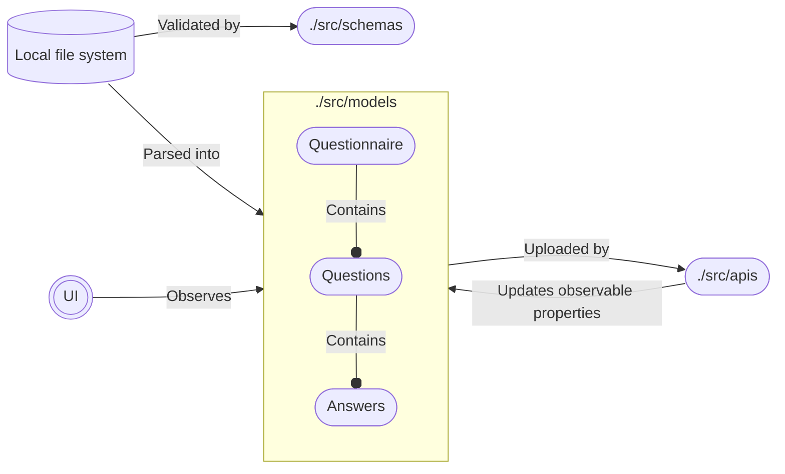

# Project structure

The project works by parsing a directory on the local system into an internal representation of a questionnaire, and then asking site-specific APIs to upload those to the site.

The code structure can be visualized using the following diagram:

## `./src/schemas`

Contains the JSON structure that should be used by the files we're parsing, and logic to validate them. This is what is documented in `docs/file_format.md`, and is kept in a folder of their own (instead of being located alongside the models that they are parsed into) to indicate that they should not be changed: while the internal model representation can change freely, the user-facing schemas must not (outside of major versions).

The schemas are defined using [zod](https://github.com/colinhacks/zod), to allow easy type checking and validator generation.

## `./src/models`

Contains the internal models that we parse the schemas into. These represent an AST of the intended questionnaire structure, with one global questionnaire that contains multiple questions, each containing multiple answers. These are largely hand-written.

The models contain observable properties (using [nanostores](https://github.com/nanostores/nanostores)) to allow the UI to update when they change. These properties are named with a leading dollar sign, and are usually things like `$error`, `$uploaded`, `$progress`, or similar. The properties usually aren't updated by the models themselves, but are updated by logic that affects their state (e.g. `$uploaded` is set by the API implementations, when they are done uploading the model).

## `./src/apis`

Contains the site-specific APIs we use to upload our internal models. As the different sites implement vastly different backend APIs, these are generally one-shot: they are given a tree of our internal models, and are asked to upload it. How they do that is entirely up to them.

The APIs should update the observable properties of the models as needed, to allow the UI to display the progress.
