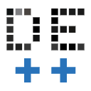

# Digital Eksamen Enhancer

A browser extension to add new features to Digital Eksamen (and related subsystems).  
Not affiliated with Digital Eksamen in any way.

Mass-upload questions using file-based configuration <em>(click to show more)</em>

Allows you to specify a set of exam questions [using files](/docs/file_format.md), and then uploading those to a questionnaire in one go.  
To use you'll need a valid `manifest.json` file (you can use [the examples](/examples/) to try it out), and then:

1. Make sure the extension is [installed](#installation)
1. Navigate to [the list of questionnaires](https://designer.mcq.digitaleksamen.sdu.dk/) on DigitalEksamen
1. Click the new "Add questionnaire from file" button:
   

   

   

1. Choose the folder containing your `manifest.json` file, or the `manifest.json` file itself (depending on what your browser allows you to do):
   

   

   

1. Wait for the upload to complete:
   

   

   

1. **Verify** that the uploaded exam matches your expectations.

## Installation

<table><thead><tr><th width="441">Chrome</th><th width="441">Firefox</th></tr></thead>
<tbody><tr><td>

1. Navigate to [the latest release here on GitHub](https://github.com/birjj/digitaleksamen-enhancer/releases/latest)
1. Download the file ending in ".zip"
1. Extract the ZIP file somewhere
1. Navigate to `chrome://extensions` in your browser and enable developer mode (toggle in top-right)
1. Click "Load unpacked" and choose the `dist` folder from the extracted ZIP file

</td><td>

1. Navigate to [the latest release here on GitHub](https://github.com/birjj/digitaleksamen-enhancer/releases/latest)
1. Download the file ending in ".xpi"
1. Allow the extension to be installed when prompted
1. Go to https://designer.mcq.digitaleksamen.sdu.dk/
1. Click the extensions icon in your browser (the puzzle icon), click the cog wheel next to the extension and choose "Always Allow on ..."

</td></tr></tbody></table>
